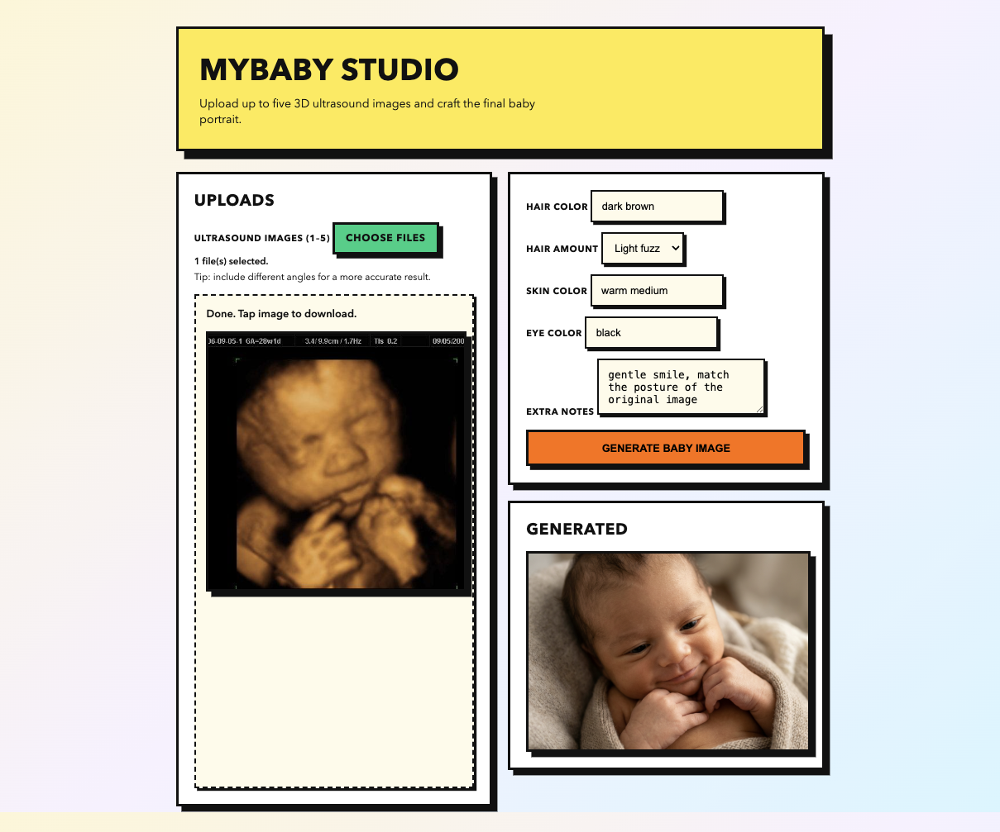

# My Babay!




An app motivated by [this tweet](https://x.com/javilopen/status/2006414611851911586?s=46), transforming 3D ultrasound images of a baby into a portrait using the power of Nano Banan Pro.
Users can upload 1–5 images, set appearance parameters, and receive a generated image.

## Features

- Upload up to 5 ultrasound images with live previews.
- Customize hair color, hair amount, skin color, and eye color.
- Gemini-powered prompt refinement + image generation.
- Progress indicator during upload/generation.

## Requirements

- Python 3.11+
- `uv`
- A Gemini API key in `.env`

## Setup (uv only)

```bash
uv venv
uv pip install -e '.[dev]'
```

Create a `.env` file with your Gemini credentials:

```bash
cp .env.example .env
```

Set `GEMINI_API_KEY` in `.env` (do not commit it).

## Run

```bash
uv run python -m mybaby.app
```

Open http://127.0.0.1:5000 and upload 1–5 ultrasound images.

The app uses fixed Gemini models:
- `gemini-3-pro-preview` (prompt refinement)
- `gemini-3-pro-image-preview` (image generation)

## Standalone sample

```bash
uv run python scripts/run_sample.py
```

You can pass a custom image path:

```bash
uv run python scripts/run_sample.py /path/to/image.jpg
```

## Lint

```bash
uv run ruff check .
```
